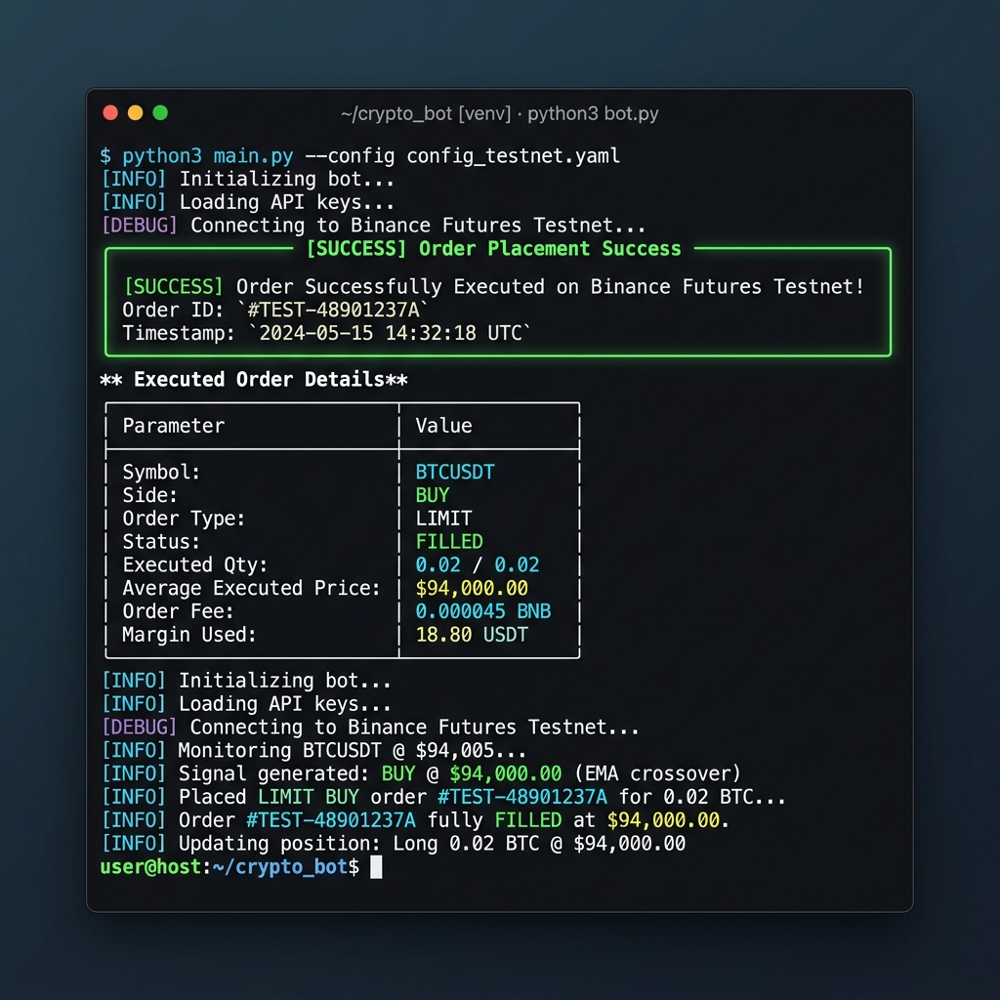

# Binance Futures Testnet Trading Bot

A production-style Python CLI application for placing and managing orders on the Binance USDT-M Futures Testnet.

The project is designed to showcase clean software architecture, resilient API integration patterns, and a polished terminal experience. It includes strict input validation, signed request handling, automatic time synchronization, structured logging, retry-safe HTTP communication, and both direct and interactive trading workflows.



---

# Features

## Order Support

Supports the most commonly used Binance Futures order types:

* `MARKET`
* `LIMIT`
* `STOP_MARKET`
* `STOP` (Stop-Limit)

Supported order sides:

* `BUY`
* `SELL`

Conditional orders include full trigger-price validation and parameter enforcement.

Examples:

* Market Buy
* Limit Sell
* Stop-Market Exit
* Stop-Limit Entry

---

# Robust Binance API Client

The REST client is built with reliability and production behavior in mind.

### Included Features

* HMAC SHA256 request signing
* Automatic Binance server time synchronization
* Timestamp offset correction
* Persistent HTTP session pooling
* Retry handling with exponential backoff
* Automatic recovery from transient `429` and `5xx` responses

The startup synchronization step helps eliminate the common Binance timestamp drift issue:

```text
APIError(code=-1021): Timestamp for this request was outside of the recvWindow
```

---

# Terminal Experience

Built using `Typer` and `Rich` for a clean developer-focused CLI experience.

## Direct CLI Mode

Execute orders directly from the terminal using command flags.

Example:

```bash
python cli.py place --symbol BTCUSDT --side BUY --type MARKET --quantity 0.02
```

---

## Interactive Wizard Mode

Launch the guided interactive workflow:

```bash
python cli.py
```

or

```bash
python cli.py interactive
```

The wizard provides:

* Step-by-step prompts
* Inline validation
* Human-readable error messages
* Order preview tables
* Final execution confirmation

The goal is to make the trading flow safe, fast, and difficult to misuse.

---

# Logging & Diagnostics

The application uses dual-destination logging:

### Console Logging

* Colorized Rich output
* Clean status messages
* Readable execution flow

### File Logging

* Persistent debug logs written to:

  ```text
  trading_bot.log
  ```
* Rotating log files (10MB max size)
* Full request/response tracing in debug mode
* Automatic credential masking

Sensitive values such as signatures and secrets are never written directly to logs.

---

# Project Structure

```text
Trading Bot/
├── bot/
│   ├── __init__.py
│   ├── client.py
│   ├── exceptions.py
│   ├── logging_config.py
│   ├── orders.py
│   └── validators.py
│
├── tests/
│   └── test_bot.py
│
├── cli.py
├── requirements.txt
├── .env.template
└── README.md
```

---

# Requirements

* Python 3.8+
* Binance Futures Testnet account

Testnet:
https://testnet.binancefuture.com/

---

# Installation

## 1. Clone the Repository

```bash
git clone <repository-url>
cd "Trading Bot"
```

---

## 2. Create a Virtual Environment

### Windows (PowerShell)

```bash
python -m venv venv
.\venv\Scripts\Activate.ps1
```

### macOS / Linux

```bash
python -m venv venv
source venv/bin/activate
```

---

## 3. Install Dependencies

```bash
pip install -r requirements.txt
```

---

## 4. Configure Environment Variables

Copy the template:

```bash
cp .env.template .env
```

Add your Binance Futures Testnet credentials:

```env
BINANCE_API_KEY=your_testnet_api_key
BINANCE_API_SECRET=your_testnet_secret
```

---

# Usage

# Run Unit Tests

```bash
python -m unittest tests/test_bot.py
```

The test suite validates:

* Signature generation
* Parameter validation
* Exception handling
* Core business logic

---

# Trading Examples

## MARKET Order

```bash
python cli.py place \
  --symbol BTCUSDT \
  --side BUY \
  --type MARKET \
  --quantity 0.02
```

---

## LIMIT Order

```bash
python cli.py place \
  --symbol BTCUSDT \
  --side SELL \
  --type LIMIT \
  --quantity 0.01 \
  --price 95000
```

---

## STOP_MARKET Order

```bash
python cli.py place \
  --symbol ETHUSDT \
  --side SELL \
  --type STOP_MARKET \
  --quantity 0.05 \
  --stop-price 3000
```

---

## STOP (Stop-Limit) Order

```bash
python cli.py place \
  --symbol ETHUSDT \
  --side BUY \
  --type STOP \
  --quantity 0.05 \
  --stop-price 3500 \
  --price 3510
```

---

# Debug Mode

Enable verbose request/response logging:

```bash
python cli.py place \
  --symbol BTCUSDT \
  --side BUY \
  --type MARKET \
  --quantity 0.01 \
  --debug
```

Debug mode includes:

* Outgoing payloads
* Request signatures
* Endpoint traces
* Raw API responses
* Retry behavior visibility

---

# Design Goals

This project focuses heavily on engineering quality rather than simply placing orders.

Core goals include:

* Clear separation of concerns
* Strong validation boundaries
* Predictable exception handling
* Production-style logging
* Safe API interaction patterns
* Developer-friendly CLI workflows
* Testable architecture

The codebase is intentionally structured to resemble maintainable real-world backend tooling rather than a minimal scripting project.

---

# Disclaimer

This project is intended for educational and engineering demonstration purposes only.

It is configured for the Binance Futures Testnet environment and should not be used in production trading without additional security review, risk controls, and operational safeguards.
